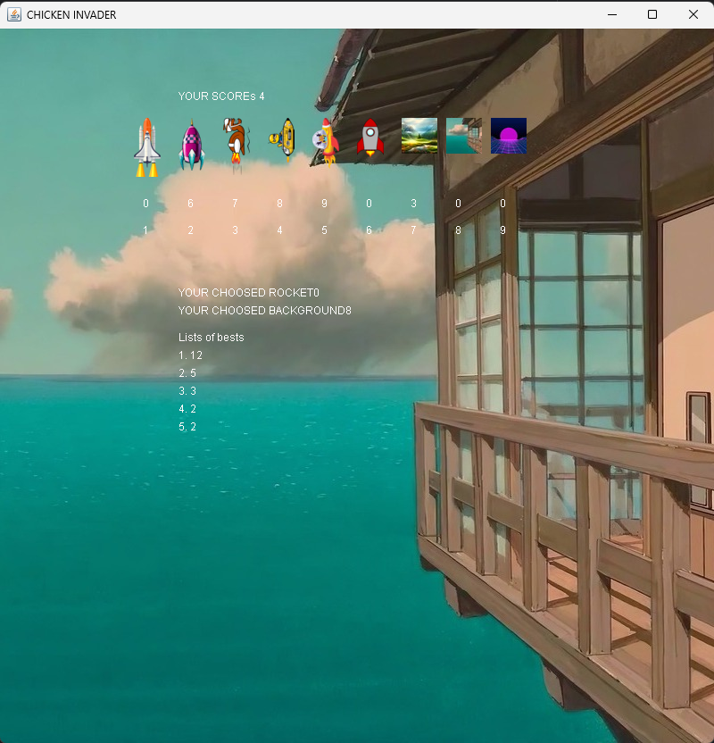
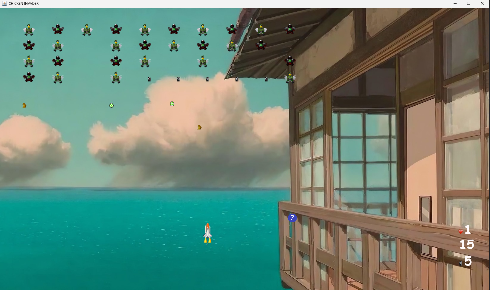

# Chickens Invader 🐔🚀

**Chickens Invader** is a simple **arcade-style 2D game** inspired by classic space shooters.
The player controls a spaceship and fights waves of incoming enemies, collects points, upgrades abilities, and competes for the best score.

The project was created as a **learning and hobby game**, with focus on game logic, state management, and basic UI elements such as a shop and leaderboard.

---

## Gameplay

* Control a spaceship and shoot incoming enemies
* Avoid enemy attacks and survive as long as possible
* Earn points for destroying enemies
* Use earned points to buy upgrades
* Try to reach the highest score and appear on the leaderboard

---

## Key Features

* 🚀 **Arcade shooter gameplay**
* 🐔 Waves of enemies with increasing difficulty
* 🛒 **In-game shop**

  * spend points on upgrades
  * visible list of available items and prices
* 🏆 **Leaderboard / best scores list**
* 🎮 Real-time gameplay with score tracking

---

## Demo

### Gameplay GIF

*(shows core gameplay, movement, shooting, enemies)*


---

## Screenshots

### Shop & Leaderboard

*(shop with available upgrades, current score, and list of best players)*



### In-game action

*(actual gameplay view)*




---

## Controls

* **Arrow keys / WASD** – move the ship
* **Space** – shoot
* **P** – pause / menu

---

## How to run

### Option 1: IntelliJ IDEA

1. Open the project in IntelliJ IDEA.
2. Let the IDE download dependencies (if using Maven/Gradle).
3. Run the main class (e.g. `Main` / `GameApp`).

### Option 2: Command line (if applicable)

```bash
mvn clean javafx:run
```

---

## Technical Notes

* Written in **Java**
* Simple game loop and collision detection
* Separate game states (menu, gameplay, shop)
* Score system and leaderboard logic

This project focuses more on **game mechanics and logic** than advanced graphics.

---

## Possible Improvements

* More enemy types and attack patterns
* Sound effects and background music
* Power-ups during gameplay
* Saving/loading progress
* Improved animations and visual effects

---

## Author

**Dominik (dominikoka)**
